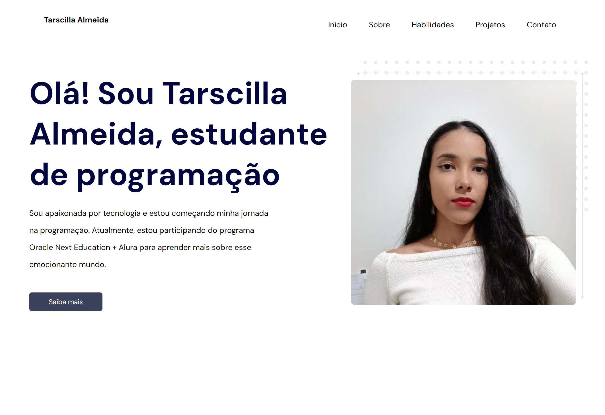

# 🗂️ Portfólio
Este é o repositório do meu site de portfólio pessoal, onde compartilho minha jornada e mostro meus projetos mais recentes. Meu portfólio é uma vitrine interativa das minhas habilidades e realizações em desenvolvimento web e muito mais.
#

[Clique aqui para acessar](https://tarscilla.github.io/portfolio/) 

## 💻 Recursos Principais 

* __Experiência Profissional__: Explore minha trajetória profissional e minhas habilidades.

* __Projetos Destacados__: Veja meus projetos mais recentes e significativos.

* __Contato__: Entre em contato comigo para oportunidades de colaboração, estudarmos juntos ou simplesmente para dizer olá.

## 📱 Minhas Principais Redes 

<a href="https://twitter.com/tarscilla_" alt="Twitter">

  
<a href="https://instagram.com/http_taci" alt="Instagram">

